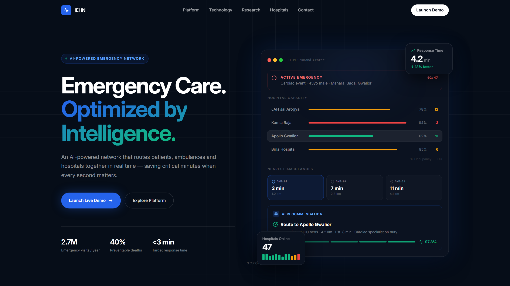
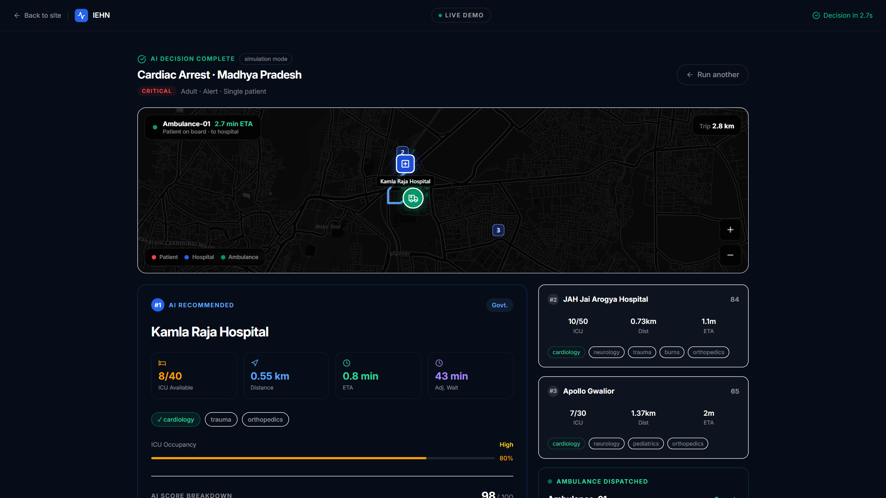
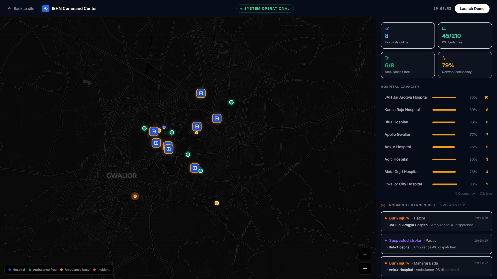
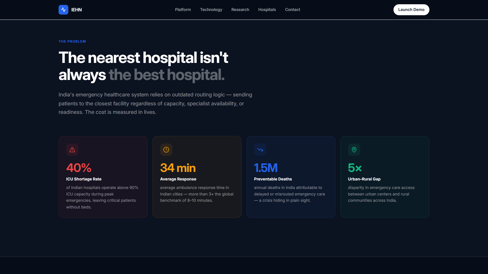

# IEHN — Intelligent Emergency Healthcare Network

### 🔴 [**Live Demo → intelligent-emergency-healthcare-ne.vercel.app**](https://intelligent-emergency-healthcare-ne.vercel.app) &nbsp;·&nbsp; try [`/demo?go=cardiac`](https://intelligent-emergency-healthcare-ne.vercel.app/demo?go=cardiac) for an instant dispatch run

An AI-powered emergency healthcare network that connects **patients, ambulances, and hospitals** in real time. When an emergency is reported, the engine scores every registered hospital on distance, live ICU capacity, specialty match, and predicted wait time — then dispatches the nearest ambulance and shows the whole journey on a live map.

Built on real hospital data from **Gwalior, Madhya Pradesh** (8 hospitals · 8 ambulances).

   [](https://intelligent-emergency-healthcare-ne.vercel.app)



**Live AI dispatch** — road-following OSRM route, animated ambulance with countdown ETA, ranked alternatives:



---

## Quick start

### 1. Frontend (the web app)

```bash
cd frontend
npm install
npm run dev          # → http://localhost:5173
```

The app is fully functional on its own — if the backend is offline it computes recommendations **in-browser** with the same scoring math (you'll see a small "simulation mode" chip on results).

### 2. Backend API (optional, recommended)

```bash
pip install -r requirements.txt
python Src/app.py    # → http://localhost:5000
```

The Vite dev server proxies `/api/*` to Flask automatically. With Flask running, the demo uses live API responses.

### 3. Open it on your phone / tablet

The dev server listens on your local network. With your phone on the **same Wi-Fi**:

1. Find your PC's IP — run `ipconfig` and look for *IPv4 Address* (e.g. `192.168.1.5`).
2. On the phone, open `http://<that-ip>:5173` (Vite also prints this as the *Network* URL on startup).

The UI is fully touch-optimized: pinch-zoom on the dispatch map, one-finger page scrolling, 40 px+ tap targets, and keyboard hints hidden on touch screens.

> **Note on GPS:** browsers only allow `navigator.geolocation` on HTTPS or localhost, so over plain `http://192.168...` the phone will skip straight to the Gwalior city-centre default — the demo still works end-to-end. Deploy behind HTTPS (or use a tunnel like `ngrok`/`cloudflared`) to get real GPS on devices.

---

## The demo flow (`/demo`)

1. **Location detection** — GPS + reverse-geocoding (Nominatim), with a *Skip* button and a Gwalior city-centre fallback so you're never blocked.
2. **Emergency type** — Cardiac Arrest, Road Trauma, Stroke, Severe Burns, Pediatric (keys `1–5`).
3. **Quick triage** — patient age, responsiveness, people affected. Findings escalate the displayed severity (e.g. Pediatric + Unresponsive → **Critical**) and give young patients a paediatrics-aware scoring nudge. Press `Enter` to dispatch with defaults.
4. **AI decision** — animated processing terminal, then results:
   - **Live dispatch map** (dark Ola/Uber style): ambulance animates along **real road routes** (OSRM) from base → patient → hospital with a countdown ETA and phase labels. Zoom (+/−), drag-to-pan, pinch. Runner-up hospitals plotted as dimmed pins.
   - **#1 recommendation** with score breakdown (distance 40% · ICU 30% · specialty 20% · wait 10%), ICU occupancy, adjusted wait.
   - **Alternatives (#2, #3)**, nearest-ambulance card, and a "why not the nearest hospital?" explanation when relevant.

**Shortcuts:** `1–5` choose emergency · `Enter` dispatch · `Esc` back/reset.
**Deep links:** `/demo?go=cardiac` (or `trauma` / `neuro` / `burns` / `pediatric`) auto-runs a scenario — handy for sharing.

---

## The Command Center (`/command`)

A city-wide operations view of the whole network: all 8 hospitals with live occupancy rings, the ambulance fleet (free/busy), network-level stats, and an incoming-emergency feed — **every simulated call is routed by the same AI scoring engine that powers the demo**. Click any hospital in the capacity list to fly the map to it.





---

## How the AI scoring works

```
score = distance_score·0.40 + icu_ratio·0.30 + specialty·0.20 + wait_score·0.10

distance_score = 1 / (km + 0.1)              # haversine
icu_ratio      = available_beds / total_beds
specialty      = 1.5 if match else 0.5       # +0.3 paediatrics nudge for infants/children
wait_score     = 1 / (adjusted_wait + 1)     # wait scaled by occupancy (1.0×–2.5×)
```

Identical implementations in Python ([Src/hospital_recommender.py](Src/hospital_recommender.py)) and TypeScript ([frontend/src/lib/recommender.ts](frontend/src/lib/recommender.ts)) — the browser fallback gives the same answer as the API.

## API

| Endpoint | Method | Description |
|---|---|---|
| `/api/health` | GET | Service status + dataset counts |
| `/api/hospitals` | GET | All hospitals with capacity + specialties |
| `/api/ambulances` | GET | Fleet with live status |
| `/api/recommend` | POST | `{patient_lat, patient_lon, emergency_type, triage?}` → ranked hospitals + nearest ambulance |

```bash
curl -X POST http://localhost:5000/api/recommend \
  -H "Content-Type: application/json" \
  -d '{"patient_lat":26.212,"patient_lon":78.185,"emergency_type":"cardiology","triage":{"age":"adult","consciousness":"alert","casualties":"single"}}'
```

## Project structure

```
├── frontend/                 # React 18 + TypeScript + Vite + Tailwind
│   └── src/
│       ├── pages/            # LandingPage, DemoPage, CommandCenter (network ops view)
│       ├── components/       # LiveMap (Leaflet + OSRM), NetworkMap, landing sections
│       ├── lib/recommender.ts# In-browser scoring engine (mirrors backend)
│       └── data/gwalior.ts   # Hospital + ambulance dataset (mirrors Data/*.csv)
├── Src/
│   ├── app.py                # Flask JSON API
│   ├── hospital_recommender.py  # Scoring engine
│   ├── occupancy_predictor.py   # Occupancy → adjusted wait model
│   ├── route_optimizer.py       # Haversine, ETA, nearest ambulance
│   └── main.py               # Streamlit prototype UI (alternate)
├── Data/                     # hospitals.csv · ambulances.csv · patients.csv
└── requirements.txt
```

## Tech stack

**Frontend** React 18, TypeScript, Vite, Tailwind CSS, Framer Motion, Leaflet + react-leaflet, Lucide icons
**Maps & geo** OpenStreetMap/CARTO dark tiles, OSRM public routing, Nominatim reverse geocoding, browser Geolocation API
**Backend** Flask (JSON API), CSV datasets — Phase 2 swaps in live hospital feeds + a trained wait-time model

## Roadmap

- **2026 — Prototype** (this repo): AI routing engine, live dispatch map, triage-aware severity
- **2027 — Pilots**: 3–5 hospitals + ambulance networks
- **2028 — Multi-city rollout**, NHM integration
- **2030 — National network**
